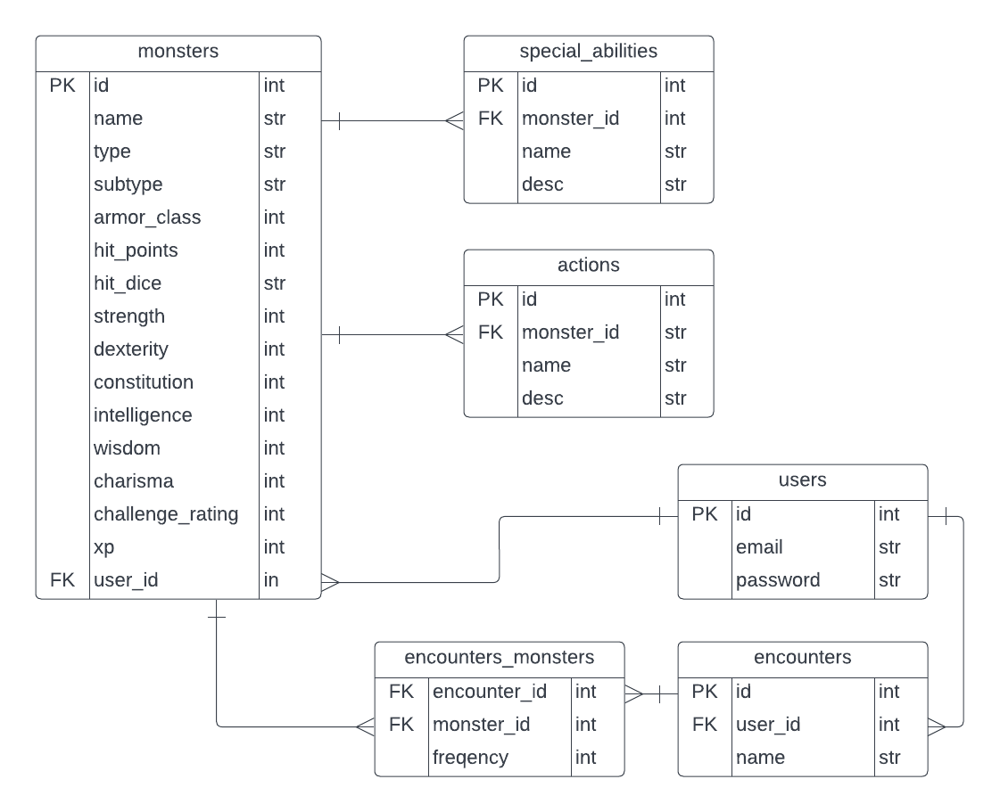

# Capstone 1 Project

## Background Information

_Dungeons & Dragons_ (D&D) is a roleplaying game in which an epic quest is undertaken by a team of fantasy heroes. Most of the players in a game of D&D embody the heroes, and as the game unfolds these players explain how their heroic characters overcome the challenges that they encounter.

One player in a game of D&D has a special role, called “Dungeon Master (DM)” or “Game Master (GM).” The GM’s job is part narrator and part referee. The GM presents obstacles to the heroes and adjudicates the results of their attempts to overcome those obstacles. One type of obstacle that a GM may choose is a monster that the players must defeat.

## Project Audience & Goals

The primary audience for my website is D&D Game Masters who are designing monster encounters for their players. The site will allow GMs to browse and filter a database of monsters based on their attributes. GMs will be able to build an encounter by choosing combinations monsters that can be analyzed for the challenge they pose. GMs will also be allowed to edit monsters and save their customized monsters for future use.
Several online tools exist to assist a GM in planning a monster encounter that will neither be too easy nor too hard for their players to handle. My main inspiration here is [Kobold Fight Club](https://koboldplus.club/#/encounter-builder), though this site lacks a convenient “monster viewer” (for example, something like can be found at [Open5e](https://open5e.com/monsters/adult-black-dragon)).

My project will largely mirror the functionality of Kobold Fight Club, and extend the functionality to include a monster view. This monster view will also be made available in “edit mode,” such that users can modify existing monsters by adjusting their statistics and abilities. This functionality would be similar to that found at the flagship D&D product, [D&D Beyond](https://www.dndbeyond.com/monsters).

## Database

The website will store data in a custom database (see schema below). Data associated with monsters, special abilities, and actions will be pulled from the [D&D 5th Edition API](https://www.dnd5eapi.co/) and stored in the database.

The database will also include information about users to the site, requiring registration, authentication, and password encryption on the server side. Registered users will bel able to modify and save “encounters” (collections of monsters). Users will also be allowed to edit monsters and save them as new monsters in the database.

